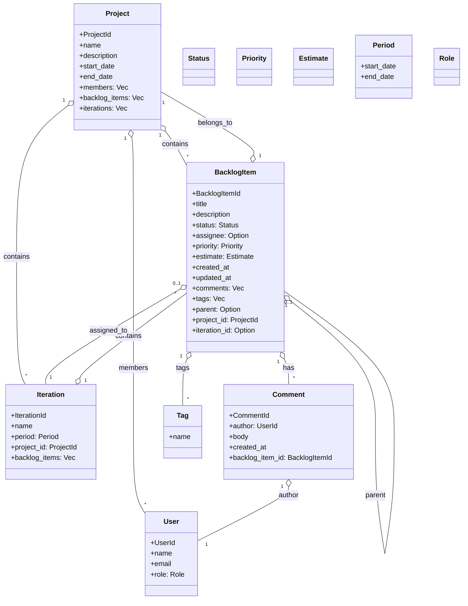

# プロジェクト/Backlog管理アプリ ドメインレイヤ設計

このドキュメントは、**ドメイン駆動設計 (DDD)** に基づく「プロジェクト/Backlog管理アプリ」のドメインレイヤ設計をまとめたものです。  
本アプリケーションのユースケース（アプリケーションサービス）は別途定義し、本ドキュメントではドメインレイヤに関する情報のみを記載します。

---

## 目次

- [1. ドメインモデル図（Mermaid記法）](#1-ドメインモデル図mermaid記法)
- [2. エンティティ定義](#2-エンティティ定義)
- [3. 値オブジェクト](#3-値オブジェクト)
- [4. 集約 (Aggregate)](#4-集約-aggregate)
- [5. ドメインサービス例](#5-ドメインサービス例)
- [6. ドメインイベント例](#6-ドメインイベント例)
- [7. 用語集（ユビキタス言語）](#7-用語集ユビキタス言語)

---

## 1. ドメインモデル図（Mermaid記法）



---

## 2. エンティティ定義

### Project
- `project_id: ProjectId`
- `name: String`
- `description: String`
- `start_date: NaiveDate`
- `end_date: NaiveDate`
- `members: Vec<UserId>`
- `backlog_items: Vec<BacklogItemId>`
- `iterations: Vec<IterationId>`

### BacklogItem
- `backlog_item_id: BacklogItemId`
- `title: String`
- `description: String`
- `status: Status`
- `assignee: Option<UserId>`
- `priority: Priority`
- `estimate: Estimate`
- `created_at: DateTime<Utc>`
- `updated_at: DateTime<Utc>`
- `comments: Vec<CommentId>`
- `tags: Vec<Tag>`
- `parent: Option<BacklogItemId>`
- `project_id: ProjectId`
- `iteration_id: Option<IterationId>`

### Iteration
- `iteration_id: IterationId`
- `name: String`
- `period: Period`
- `project_id: ProjectId`
- `backlog_items: Vec<BacklogItemId>`

### User
- `user_id: UserId`
- `name: String`
- `email: String`
- `role: Role`

### Comment
- `comment_id: CommentId`
- `author: UserId`
- `body: String`
- `created_at: DateTime<Utc>`
- `backlog_item_id: BacklogItemId`

---

## 3. 値オブジェクト

- `Status`: バックログアイテムの状態（例: Todo, InProgress, Review, Done）
- `Priority`: 優先度（例: High, Medium, Low）
- `Estimate`: 見積もりポイント（例: u32, または S/M/L/XL 等のenum）
- `Tag`: ラベル（文字列）
- `Period`: 開始日・終了日のペア
- `Role`: ユーザー権限（Admin, Memberなど）

---

## 4. 集約 (Aggregate)

- **Project集約**
  - ルート: `Project`
  - 子: `BacklogItem`, `Iteration`, `User`（所属情報のみ）

- **BacklogItem集約**
  - ルート: `BacklogItem`
  - 子: `Comment`, `Tag`

- **Iteration集約**
  - ルート: `Iteration`
  - 子: `BacklogItem`（イテレーション内のものだけ）

---

## 5. ドメインサービス例

- タスク割当てルール（担当者の負荷分散や権限チェック）
- イテレーションへのタスク移動ルール
- 状態遷移バリデーション（例: 完了にするにはレビュー済みでなければならない）

---

## 6. ドメインイベント例

DDDスタイルでRustの命名規則に従った主なドメインイベント例です。

```rust
struct BacklogItemCreated {
    backlog_item_id: BacklogItemId,
    project_id: ProjectId,
    creator_id: UserId,
    created_at: DateTime<Utc>,
}

struct BacklogItemStatusChanged {
    backlog_item_id: BacklogItemId,
    old_status: Status,
    new_status: Status,
    changed_by: UserId,
    changed_at: DateTime<Utc>,
}

struct BacklogItemAssigned {
    backlog_item_id: BacklogItemId,
    assignee_id: UserId,
    assigned_by: UserId,
    assigned_at: DateTime<Utc>,
}

struct IterationCreated {
    iteration_id: IterationId,
    project_id: ProjectId,
    created_by: UserId,
    created_at: DateTime<Utc>,
}

struct CommentAdded {
    comment_id: CommentId,
    backlog_item_id: BacklogItemId,
    author_id: UserId,
    created_at: DateTime<Utc>,
}

struct ProjectMemberAdded {
    project_id: ProjectId,
    user_id: UserId,
    added_by: UserId,
    added_at: DateTime<Utc>,
}
```

---

## 7. 用語集（ユビキタス言語）

- **Project**: プロジェクト全体を表す単位
- **BacklogItem**: タスク・課題・バグ等の管理対象
- **Iteration**: 開発の反復単位（スプリント）
- **User**: アプリケーションの利用者
- **Comment**: バックログアイテムへのコメント
- **Tag**: バックログアイテムに付与するラベル
- **Status**: バックログアイテムの進捗状態
- **Priority**: 優先度
- **Estimate**: 見積もりポイント
- **Role**: ユーザーの権限
- **Period**: 期間（開始日・終了日）

---

## 備考

- Rustで実装する際は、構造体・enum名はUpperCamelCase、フィールドはsnake_case を推奨します。
- アプリケーション層（ユースケース）はこのドメインモデルを呼び出してユースケースを実装してください。
