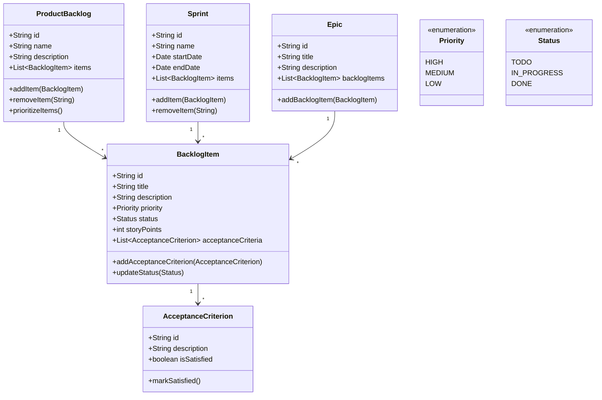

# プロダクトバックログのドメインモデル

このモジュールは、アジャイル開発におけるプロダクトバックログのドメインモデルを実装しています。

## ドメインモデル図


```mermaid
classDiagram
    class ProductBacklog {
        +String id
        +String name
        +String description
        +List~BacklogItem~ items
        +addItem(BacklogItem)
        +removeItem(String)
        +prioritizeItems()
    }

    class BacklogItem {
        +String id
        +String title
        +String description
        +Priority priority
        +Status status
        +int storyPoints
        +List~AcceptanceCriterion~ acceptanceCriteria
        +addAcceptanceCriterion(AcceptanceCriterion)
        +updateStatus(Status)
    }

    class AcceptanceCriterion {
        +String id
        +String description
        +boolean isSatisfied
        +markSatisfied()
    }

    class Sprint {
        +String id
        +String name
        +Date startDate
        +Date endDate
        +List~BacklogItem~ items
        +addItem(BacklogItem)
        +removeItem(String)
    }

    class Epic {
        +String id
        +String title
        +String description
        +List~BacklogItem~ backlogItems
        +addBacklogItem(BacklogItem)
    }

    class Priority {
        <<enumeration>>
        HIGH
        MEDIUM
        LOW
    }

    class Status {
        <<enumeration>>
        TODO
        IN_PROGRESS
        DONE
    }

    ProductBacklog "1" --> "*" BacklogItem
    BacklogItem "1" --> "*" AcceptanceCriterion
    Sprint "1" --> "*" BacklogItem
    Epic "1" --> "*" BacklogItem
```

## 主要なエンティティ

### ProductBacklog

プロダクトバックログは、プロダクトに関する全ての要求事項やアイデアを優先順位付けしたリストです。

```rust
let mut product_backlog = ProductBacklog::new(
    "ショッピングアプリ".to_string(),
    "オンラインショッピングアプリケーション".to_string(),
);
```

### BacklogItem

バックログアイテムは、プロダクトバックログ内の個々の要求事項やユーザーストーリーを表します。

```rust
let mut login_item = BacklogItem::new(
    "ログイン機能".to_string(),
    "ユーザーがメールアドレスとパスワードでログインできる".to_string(),
);
login_item.set_priority(Priority::High);
login_item.set_story_points(5);
```

### AcceptanceCriterion

受け入れ基準は、バックログアイテムが「完了」と見なされるための条件を定義します。

```rust
login_item.add_acceptance_criterion(AcceptanceCriterion::new(
    "有効なメールアドレスとパスワードでログインできる".to_string(),
));
```

### Sprint

スプリントは、特定の期間内に完了すべきバックログアイテムのセットを表します。

```rust
let now = Utc::now();
let mut sprint = Sprint::new(
    "スプリント1".to_string(),
    now,
    now + Duration::days(14),
);
```

### Epic

エピックは、関連するバックログアイテムのグループを表す大きな機能単位です。

```rust
let mut user_auth_epic = Epic::new(
    "ユーザー認証".to_string(),
    "ユーザー登録、ログイン、ログアウト機能".to_string(),
);
```

## 使用例

完全な使用例は `examples/product_backlog_example.rs` を参照してください。

```bash
cargo run --example product_backlog_example
```
